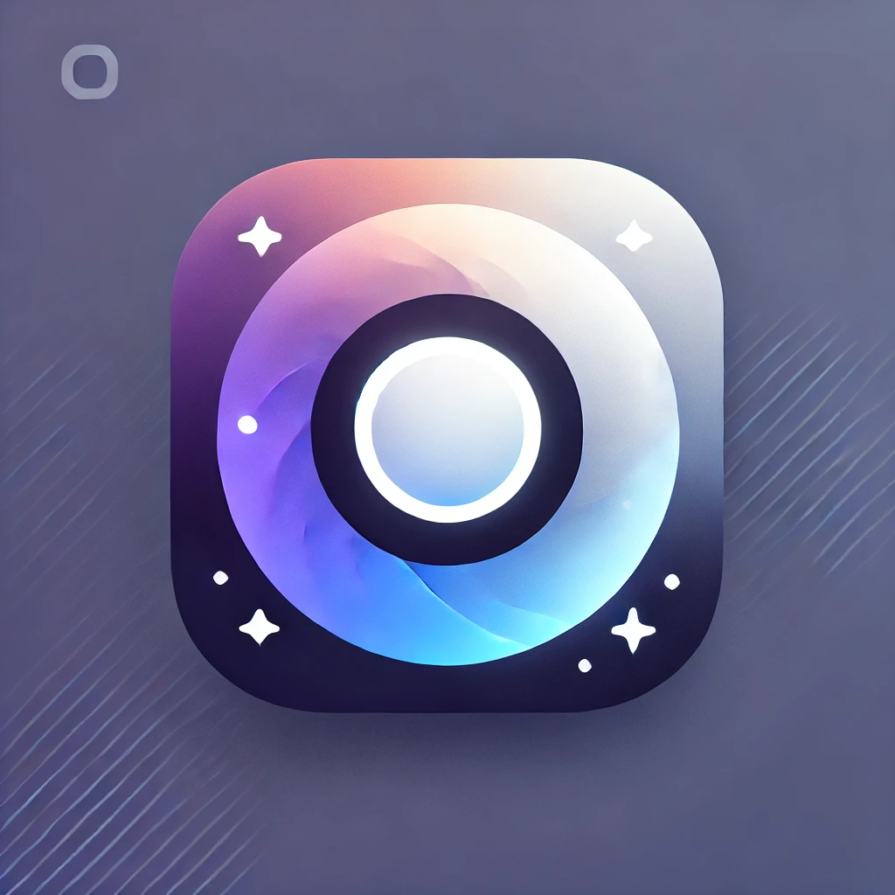

# LumiCode Theme for Visual Studio Code

LumiCode is a modern and elegant Visual Studio Code theme designed to provide a smooth and enjoyable coding experience. Featuring both light and dark modes, LumiCode offers a perfect balance between light and darkness, with carefully selected colors that reduce eye strain and improve readability.

## Features

- **Light and Dark Modes**: Seamlessly switch between light and dark themes to match your working environment.
- **High Contrast**: Clear and sharp colors designed for excellent readability.
- **Minimalist Design**: A clean and sleek look with a focus on coding.
- **Custom Syntax Highlighting**: Carefully curated colors for syntax elements, providing better code visibility.

## Installation

### Via Visual Studio Code Marketplace

1. Open Visual Studio Code.
2. Go to the Extensions view (`Ctrl+Shift+X`).
3. Search for `LumiCode`.
4. Click `Install` to install the theme.
5. Navigate to File > Preferences > Color Theme > **LumiCode Light** or **LumiCode Dark**.

### Manual Installation

1. Download the `.vsix` file from the [Releases](https://github.com/sitharaj88/lumicode/releases) page.
2. Open Visual Studio Code.
3. Go to the Extensions view (`Ctrl+Shift+X`).
4. Click on the three dots (`...`) in the top-right corner and choose `Install from VSIX...`.
5. Select the downloaded `.vsix` file to install.

## Usage

To switch between the light and dark modes:

1. Open the command palette (`Ctrl+Shift+P` or `Cmd+Shift+P` on macOS).
2. Type `Color Theme`.
3. Select **LumiCode Light** or **LumiCode Dark**.

## Contributing

Contributions, issues, and feature requests are welcome! Feel free to check the [issues page](https://github.com/sitharaj88/lumicode/issues) if you want to contribute.

## License

This project is licensed under the [Apache License 2.0](LICENSE).

## Author

- **Sitharaj Seenivasan** - [sitharaj88](https://github.com/sitharaj88)